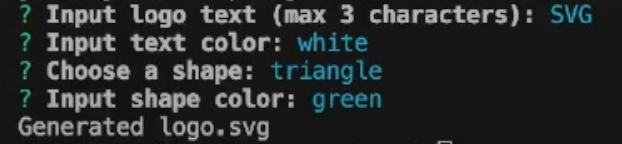

# 

## Description
[Click here to see a walkthrough video](https://drive.google.com/file/d/16In-Wof--U93DDmGmEMq0XrsGy1xuW6S/view?usp=sharing) of how to use Logo Craftr.

Logo Craftr is a command lined based logo creater that dynamically generates logos based on the user's input.

## Installation
First, clone the GitHub repository:

    git clone git@github.com:jacob-medina/logocraftr.git

Inside the `logocraftr` directory, install npm dependencies:

    npm install

## Usage

Once installed, execute Logo Craftr by calling:

    node index

You will be prompted to input the following about your logo:
1. **Logo text** (max 3 colors)
2. **Text color** (hexadecimal or word)
3. **Background shape** (circle, square, or triangle)
4. **Shape color** (hexadecimal or word)

Below is an example of what a user could input:

The generated `logo.svg` will be created in the `dist` folder.

## Testing

To run jest tests, install dev dependencies and run the test:

    npm install --save-dev
    npm test

## Credits
All code and images were created by me.

## License
This project is made under the [MIT License](./LICENSE).